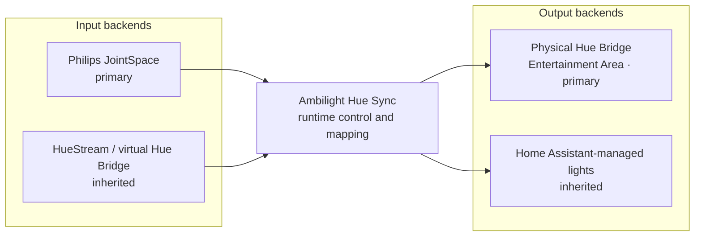

# Ambilight Hue Sync for Home Assistant

[](https://github.com/TheVosh/ha-ambilight-hue-sync/actions/workflows/tests.yaml)
[](https://github.com/TheVosh/ha-ambilight-hue-sync/actions/workflows/hacs.yaml)
[](https://github.com/TheVosh/ha-ambilight-hue-sync/actions/workflows/hassfest.yaml)
[](https://github.com/TheVosh/ha-ambilight-hue-sync/releases)

Synchronize a Philips TV's Ambilight with a physical Philips Hue Entertainment Area through
Home Assistant.

```text
Philips Ambilight TV
        ↓ JointSpace API
Home Assistant
        ↓ native Hue Entertainment streaming
Physical Philips Hue Bridge
        ↓
Hue Entertainment Area
```

This is the primary supported architecture. Some newer Philips TVs no longer expose the
traditional **Ambilight+Hue** pairing workflow, even though their JointSpace API still provides
live Ambilight measurements. Ambilight Hue Sync restores that capability through Home Assistant.

The inherited Hue-bridge emulation and Home Assistant light output remain available for compatible
setups, but they are secondary to the JointSpace → physical Hue Bridge path.

## Highlights

- Reads live Ambilight colors from `/ambilight/measured` with authenticated JointSpace requests.
- Discovers the TV's actual edge layout from `/ambilight/topology`.
- Streams natively to a selected physical Hue Entertainment Area.
- Maps every Hue channel automatically or to an explicit TV-relative position.
- Provides a compact **Ambilight Hue Sync** light entity for power and intensity.
- Works with Home Assistant's HomeKit Bridge as one power-and-brightness accessory.
- Handles inactivity, reconnects, unload/reload, Hue authorization, and deferred output setup.
- Exposes redacted diagnostics and HA-native connection/status entities.
- Preserves inherited HueStream, virtual bridge, HA-light, pause, release, and watchdog support.

## Architecture



### Input backends

- **Philips JointSpace** — primary input for newer Philips Ambilight TVs. It polls measured
  Ambilight values over the local HTTPS API with scoped Digest authentication.
- **HueStream / bridge emulation** — inherited input for TVs that still support the traditional
  Ambilight+Hue bridge-pairing workflow.

### Output backends

- **Physical Philips Hue Bridge** — primary output. Frames are sent to the selected Entertainment
  Area using native Hue Entertainment credentials and DTLS streaming.
- **Home Assistant-managed lights** — inherited output for HA/ZHA light entities, using a
  coalescing drain loop appropriate for Zigbee throughput.

## Home Assistant controls

The integration creates a compact control surface automatically:

- **Ambilight Hue Sync** (`light.ambilight_hue_sync`) — power enables or disables actual
  synchronization; brightness controls global sync intensity.
- **Connected** (`binary_sensor.hue_entertainment_bridge_connected`) — whether the configured
  output session is established.
- **Status** (`sensor.hue_entertainment_bridge_status`) — reports `disabled`, `idle`,
  `connecting`, `streaming`, `classic`, `paused`, `releasing`, or `error`.

Turning the light entity off stops the active output session and prevents JointSpace frames from
starting it again. Turning it on lets the next valid frame resume normal automatic operation.
Power and intensity survive Home Assistant restarts and integration reloads.

For Apple Home, expose only **Ambilight Hue Sync** through Home Assistant's HomeKit Bridge to get
one accessory with Power and Brightness. No HomeKit-specific helper entities are required.

## Requirements

For the primary JointSpace → physical Hue Bridge path:

- Home Assistant 2024.11 or newer
- A Philips Ambilight TV with a reachable JointSpace API
- JointSpace API credentials, version, port, and appropriate TLS verification setting
- A physical Philips Hue Bridge with an Entertainment Area created in the Hue app
- Local network reachability from Home Assistant to both devices

The virtual bridge path additionally requires the TV to reach Home Assistant on TCP port 80 and
UDP port 2100. See [Port conflicts](docs/port-conflicts.md).

## Installation

### HACS custom repository

Until this independent project is listed in HACS defaults:

1. Open HACS and select **Integrations**.
2. Open the three-dot menu and select **Custom repositories**.
3. Add `https://github.com/TheVosh/ha-ambilight-hue-sync` as an **Integration** repository.
4. Install **Ambilight Hue Sync for Home Assistant**.
5. Restart Home Assistant.

### Manual installation

1. Copy `custom_components/hue_entertainment/` into your Home Assistant configuration directory.
2. Restart Home Assistant.
3. Add **Ambilight Hue Sync** from **Settings → Devices & services**.

The internal directory remains `hue_entertainment` intentionally for compatibility.

## Primary setup: JointSpace to physical Hue

1. Create an Entertainment Area in the Philips Hue app.
2. In Home Assistant, add **Ambilight Hue Sync**.
3. Select **Philips JointSpace Ambilight API** as the TV input.
4. Enter the TV address, JointSpace credentials, API version, port, and TLS preference.
5. Select an existing Home Assistant Hue Bridge or enter its address manually.
6. Press the physical Hue Bridge link button and authorize once.
7. Select the Entertainment Area and review its per-channel Ambilight mapping.

Setup validates the TV topology and the returned Hue Entertainment credentials before marking the
output configured. Hue authorization may also be deferred and completed later from **Configure**
without re-entering the TV credentials.

### Channel mapping

Available mappings are:

- `auto`
- `top`, `bottom`
- `left_top`, `left_middle`, `left_bottom`
- `right_top`, `right_middle`, `right_bottom`

`auto` uses the Hue Entertainment Area coordinates. A manual mapping overrides the automatic
choice. `top` and `bottom` average all available zones on that edge; side segments resolve against
the configured edge orientation/reversal.

## Configuration and diagnostics

Open **Configure** on the integration card to manage sections independently:

- TV / JointSpace connection
- Philips Hue Bridge and explicit reauthorization
- Entertainment Area
- Ambilight channel mapping and edge reversal
- Performance, brightness, saturation, and inactivity settings
- Inherited virtual-bridge and Home Assistant-light options where applicable

Changing one section preserves unrelated TV and Hue credentials. Opening Configure never starts
Hue pairing automatically.

Download diagnostics from the integration card for sanitized runtime state. TV passwords, Hue
application keys, Hue client keys, tokens, PSKs, and authorization data are recursively redacted.

## Pause, resume, and release

The inherited services remain stable for existing automations:

- `hue_entertainment.pause`
- `hue_entertainment.resume`
- `hue_entertainment.release`

Their names and semantics are unchanged. See [Pause and release](docs/pause-release.md) for the
complete contract and examples.

## Existing installation compatibility

This project has a new repository and product name, but deliberately retains the existing Home
Assistant integration identity:

- Domain and directory: `hue_entertainment`
- Existing config entries and options
- Hue Bridge authorization and Entertainment credentials
- JointSpace credentials and mappings
- Entity and device registry associations
- Existing entity unique IDs
- Service names
- Persistent user/configuration storage

### Upgrade path

Existing users should only need to:

1. Update the existing custom integration through HACS or replace its files manually.
2. Restart Home Assistant or reload the integration.

No delete/reinstall, TV credential entry, Hue re-pairing, or config recreation is required.

GitHub redirects the previous repository URL to the renamed repository, including normal Git
clone/fetch/push traffic. Existing HACS custom-repository installations should therefore continue
to update. For clarity, new installations should use the new URL. If a HACS installation keeps a
cached old location, update its custom repository entry to the new URL; do not delete the Home
Assistant integration or its config entry.

Do not create a new repository at the old GitHub name later, because that would replace GitHub's
redirect.

## Inherited functionality and attribution

Ambilight Hue Sync is based on the MIT-licensed
[`83noit/ha-hue-entertainment`](https://github.com/83noit/ha-hue-entertainment) project. The
original project focuses on emulating a Hue Bridge so an Ambilight TV can drive Home
Assistant-managed Zigbee lights.

This codebase evolved into a separate project because its primary architecture is now JointSpace
input routed to a physical Hue Bridge Entertainment Area. The original virtual-bridge functionality
is retained for compatibility and remains useful as a secondary mode.

This independent project is not affiliated with, endorsed by, or an official product of Philips,
Signify, Home Assistant, or the original project maintainer. Philips, Hue, Ambilight, HomeKit, and
other trademarks belong to their respective owners.

## Project priorities

1. JointSpace → physical Hue Bridge stability
2. Home Assistant control entities
3. HomeKit-friendly controls
4. Robust reconnect and lifecycle behavior
5. Entertainment Area and channel mapping
6. Diagnostics and observability
7. Configuration UX
8. Optional support for inherited backends

Upstream merge compatibility is no longer a project priority.

## Troubleshooting

Enable sanitized debug logging:

```yaml
logger:
  default: warning
  logs:
    custom_components.hue_entertainment: debug
    custom_components.hue_entertainment.jointspace: debug
```

For JointSpace failures, verify TV credentials, API version, port, TLS behavior, and topology
support. For Hue failures, verify bridge reachability, press the link button only when explicitly
reauthorizing, and confirm that an Entertainment Area exists.

Never include TV credentials, Hue application keys, client keys, or unredacted diagnostics in an
issue. Report problems at
[`TheVosh/ha-ambilight-hue-sync`](https://github.com/TheVosh/ha-ambilight-hue-sync/issues).

## License

MIT. See [LICENSE](LICENSE). The original copyright and license notice remain preserved.
